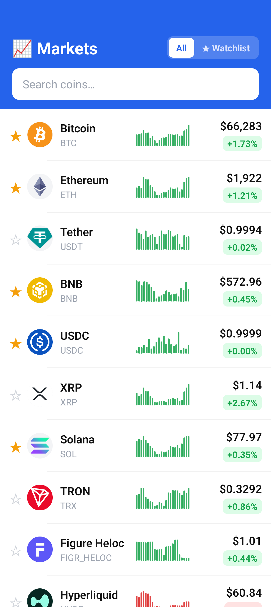

# CryptoXplore
<h3>📊 Real-Time Cryptocurrency Market Tracker</h3>

 

---
## Stack
- **React-Native**
- **JavaScript**


## Project Structure

```
cryptoxplore
├── android
│   ├── app
│   │   ├── build.gradle
│   │   ├── debug.keystore
│   │   ├── proguard-rules.pro
│   │   └── src
│   │       ├── debug
│   │       │   └── AndroidManifest.xml
│   │       └── main
│   │           ├── AndroidManifest.xml
│   │           ├── java
│   │           │   └── me
│   │           │       └── parvez
│   │           │           └── cryptoxplore
│   │           │               ├── MainActivity.kt
│   │           │               └── MainApplication.kt
│   │           └── res
│   │               ├── drawable
│   │               │   ├── rn_edit_text_material.xml
│   │               │   └── splashscreen.xml
│   │               ├── mipmap-hdpi
│   │               │   ├── ic_launcher.png
│   │               │   └── ic_launcher_round.png
│   │               ├── mipmap-mdpi
│   │               │   ├── ic_launcher.png
│   │               │   └── ic_launcher_round.png
│   │               ├── mipmap-xhdpi
│   │               │   ├── ic_launcher.png
│   │               │   └── ic_launcher_round.png
│   │               ├── mipmap-xxhdpi
│   │               │   ├── ic_launcher.png
│   │               │   └── ic_launcher_round.png
│   │               ├── mipmap-xxxhdpi
│   │               │   ├── ic_launcher.png
│   │               │   └── ic_launcher_round.png
│   │               ├── values
│   │               │   ├── colors.xml
│   │               │   ├── strings.xml
│   │               │   └── styles.xml
│   │               └── values-night
│   │                   └── colors.xml
│   ├── build.gradle
│   ├── gradle
│   │   └── wrapper
│   │       ├── gradle-wrapper.jar
│   │       └── gradle-wrapper.properties
│   ├── gradle.properties
│   ├── gradlew
│   ├── gradlew.bat
│   ├── react-settings-plugin
│   │   ├── build.gradle.kts
│   │   └── src
│   │       └── main
│   │           └── kotlin
│   │               └── expo
│   │                   └── plugins
│   │                       └── ReactSettingsPlugin.kt
│   └── settings.gradle
├── app.json
├── babel.config.js
├── index.js
├── package.json
├── package-lock.json
└── src
    ├── api.js
    ├── App.js
    ├── components
    │   ├── coin_row.js
    │   ├── error_state.js
    │   ├── loading_state.js
    │   ├── search_header.js
    │   └── sparkline.js
    ├── hooks.js
    ├── storage.js
    └── utils.js
```

---

## 🚀 Getting Started

### Prerequisites

- **Node.js** >= 18.x
- **npm** >= 9.x or **yarn** >= 1.22.x
- **Expo CLI** (`npm install -g expo-cli`)
- **Android Studio** (for Android emulator) or **Xcode** (for iOS simulator)
- **Java**

### Installation

```bash
# 1. Clone the repository
git clone https://github.com/hereparvezali/cryptoxplore.git
cd cryptoxplore

# 2. Install dependencies
npm install
# or
yarn install

# 3. Start the development server
npx expo start
```

### Running on Device / Simulator

```bash
# iOS Simulator (macOS only)
i                    # Press 'i' in the Expo CLI
# or
npm run ios

# Android Emulator
a                    # Press 'a' in the Expo CLI
# or
npm run android

# Physical Device
# Scan the QR code from the Expo Go app
```

---


### EAS Build (Recommended)

```bash
# Install EAS CLI
npm install -g eas-cli

# Login to Expo
eas login

# Configure build
eas build:configure

# Build for Android
eas build --platform android --profile production

# Build for iOS
eas build --platform ios --profile production
```

### Local Build (Bare Workflow)

```bash
# Generate native projects
npx expo prebuild

# Android
cd android
./gradlew assembleRelease

# iOS (macOS)
cd ios
xcodebuild -workspace CryptoXplore.xcworkspace -scheme CryptoXplore -configuration Release
```


